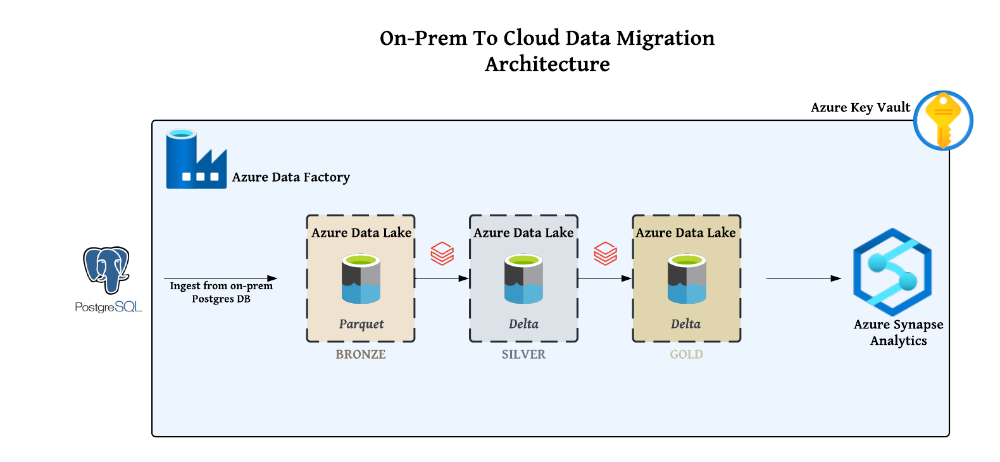
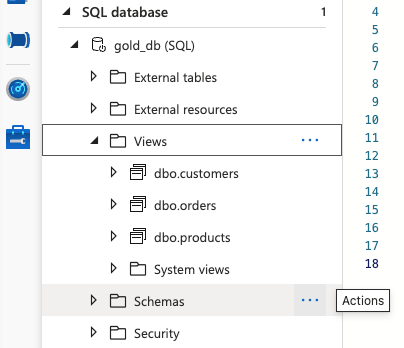
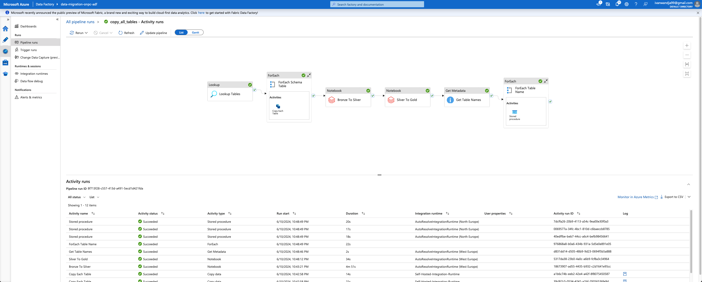

# On-Prem-to-Cloud-Data-Migration

# Architecture
This project outlines the ETL pipeline created to facilitate data migration and transformation using Azure Data Factory, Azure Data Lake, Azure Databricks, and Azure Synapse Analytics. The pipeline follows the medallion architecture, ensuring efficient data handling and transformation across different stages—bronze, silver, and gold layers.

The architecture leverages Azure Data Factory for data movement, Azure Data Lake for scalable storage, Databricks for data transformation, and Synapse Analytics for data warehousing and analytics.

Azure Key Vault was used to securely store all necessary credentials, ensuring secure access to resources throughout the project. Roles and access permissions were carefully assigned to enable different services to interact smoothly and securely.


# Data Ingestion
The data ingestion process begins with Azure Data Factory copying data from an on-premise PostgreSQL database, which is set up on a local machine. The connection to the on-premise database is established using the self-hosted integration runtime.

Once the data is copied, it is stored in Azure Data Lake Gen2. The data is initially placed in the bronze layer of the data lake in parquet format. This stage of data ingestion captures raw data, making it ready for further processing and transformation.


This setup allows seamless integration between the on-premise database and the cloud, ensuring data is consistently and reliably ingested into the cloud environment.


# Data Transformation
The data transformation process utilizes Azure Databricks to perform essential transformations on the data stored in the bronze layer. To enable Databricks to access the data in the data lake, a storage mount is created.

[See](databricks/storagemount.ipynb)
```
configs = {
  "fs.azure.account.auth.type": "CustomAccessToken",
  "fs.azure.account.custom.token.provider.class": spark.conf.get("spark.databricks.passthrough.adls.gen2.tokenProviderClassName")
}

# Optionally, you can add <directory-name> to the source URI of your mount point.
dbutils.fs.mount(
  source = "abfss://bronze@datalakesagen2.dfs.core.windows.net/",
  mount_point = "/mnt/bronze",
  extra_configs = configs)
  ```

The first transformation involves increasing the prices of products in the products table by 4%. This transformation phase demonstrates the basic functionality of the medallion architecture, where raw data is refined into a more usable form. After this transformation, the data is moved to the silver layer in delta format, enhancing its structure and quality.

In the next transformation, dates are broken down into separate columns (month, day, year) to facilitate easier analysis and querying. After this transformation, the data is moved to the gold layer, again in delta format. The gold layer contains highly refined and optimized data ready for business intelligence and analytics.


# Data Loading
With the data fully transformed and ready for use, Azure Synapse Analytics is employed to create an SQL serverless database. A stored procedure is run on this database to dynamically create views for all tables in the data lake. The stored procedure takes table names as a parameter, looping through each table name provided in the Azure Data Factory pipeline ForEach loop activity.



This process ensures that the transformed data is easily accessible for reporting and analysis, leveraging the robust querying capabilities of Azure Synapse Analytics.


Using Azure Synapse Analytics for data loading provides seamless integration with the data lake, fast query performance, and powerful analytical capabilities.

# End-To-End Pipeline Testing
To ensure the reliability and accuracy of the ETL pipeline, an end-to-end pipeline test was conducted. This test verified that the pipeline correctly handles new data added to the on-premise PostgreSQL database and that the data flows through all stages of the pipeline—from ingestion to transformation to loading—without issues.


# References
https://learn.microsoft.com/en-us/azure/databricks/archive/credential-passthrough/adls-passthrough

https://learn.microsoft.com/en-us/azure/data-factory/create-self-hosted-integration-runtime?tabs=data-factory

https://learn.microsoft.com/nl-nl/azure/role-based-access-control/role-assignments-portal?WT.mc_id=Portal-Microsoft_Azure_KeyVault

https://www.databricks.com/glossary/medallion-architecture

